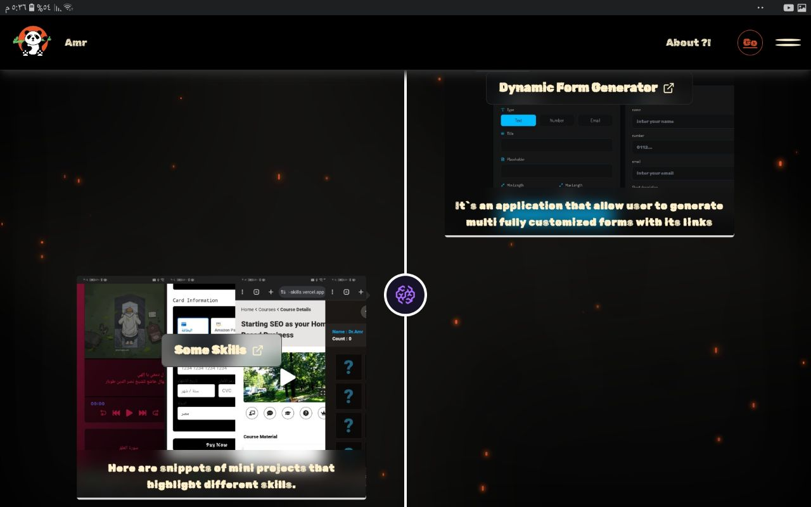
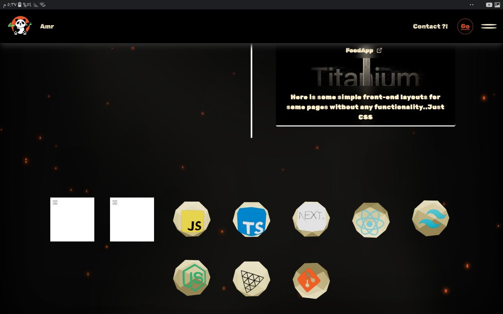
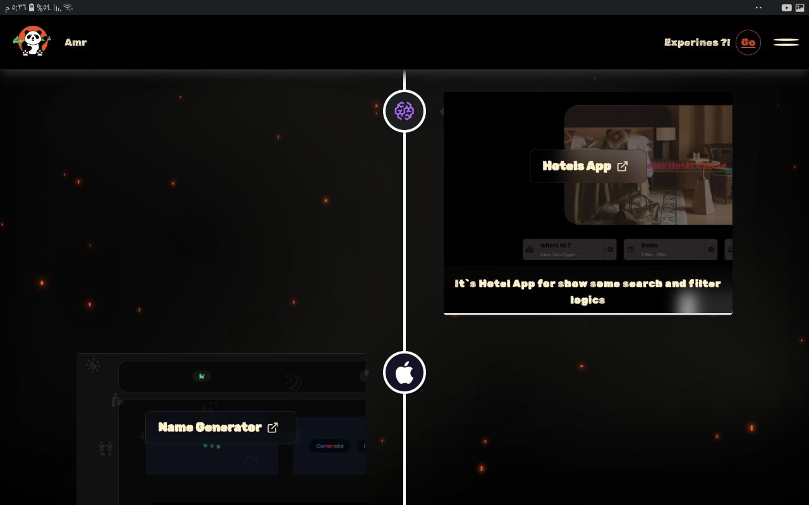
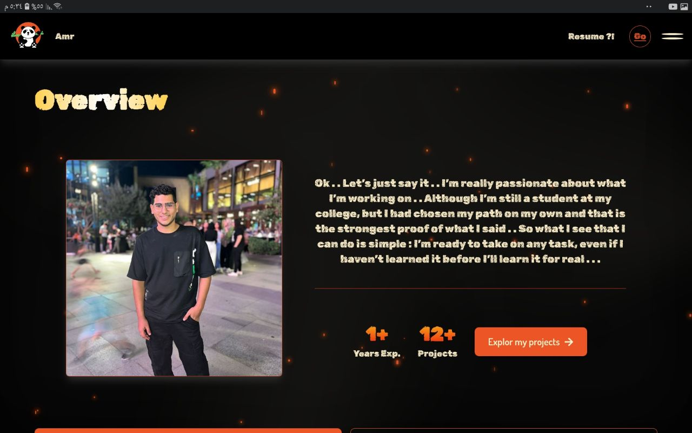

#  Dr.Coder

* Dr.Coder is a personal projects hub designed primarily for non-technical clients and visitors.
* Fullstack project focuses on a clean, highly animated UI that presents technical work in a visually engaging and professional way.

# Features
* Admin area to control the projects
* Pinned front area to show the most important/recent projects quickly 
* category-based projects page that holds all of my projects
* 3D model integration to cleanly show the contact and my tech stack
* Light animated background to add some dynamics to the site

## Technology Stack ...
* React | Next.js | TypeScript | GSAP | Tailwind CSS | Prisma 

## Preview
* Note: it is better to visit the site to see the animation

Note: More project visuals and promotional material are available in the [`docs`](./docs) directory.

